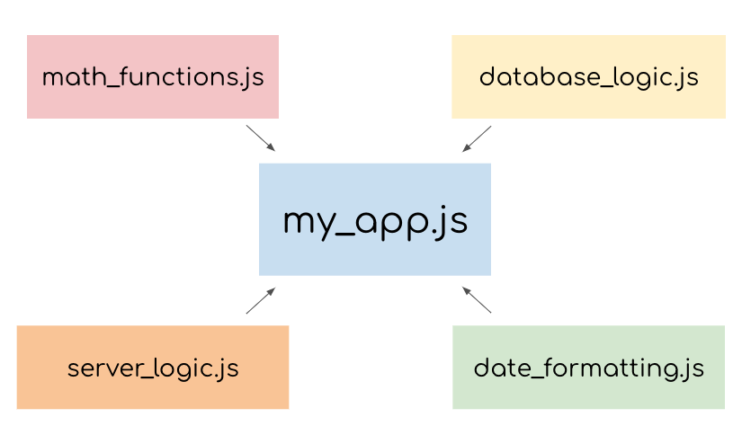

# Modules using Node.js `module.exports` and `require()`

## What are modules?

_Modules_ are reusable pieces of code in a file that can be exported and then imported for use in another program. A _modular_ program is one whose components can be separated, used individually, and recombined to create a complex system. 

Consider the diagram below of an imaginary program written in a file **my_app.js**:



Instead of having the entire program written within **my_app.js**, its components are broken up into separate modules that each handle a particular task. For example, the **database_logic.js** module may contain code for storing and retreiving data from a database. Meanwhile the **date_formatting.js** module may contain functions designed to easily convert date values from one format to another (a common headache among programmers!).

> _Note: The words "module" and "file" are often used interchangably_

This modular strategy is sometimes called _separation of concerns_ and is useful for a number of reasons. What do you think those reasons might be? 

<details>
  <summary>Write down a few of your ideas before revealing the reasons below:</summary>
  <p>
    By isolating code into separate files, called modules, we can:

-   find, fix, and debug code more easily;
-   reuse and recycle defined logic in different parts of our application;
-   keep information private and protected from other modules;
-   and, importantly, prevent pollution of the global namespace and potential naming collisions, by cautiously selecting variables and behavior we load into a program.
  </p>
</details>
<br>

Implementing modules in your program requires a small bit of management. In the remainder of this article, we will be covering:
* How to use the Node.js `module.exports` object to _export_ code from a file - meaning its functions and/or data can be used by other files/modules
* How to use the Node.js `require()` function to _import_ functions and/or data from another module

## Implementations of Modules in JavaScript: Node.js vs ES6

Before we dive in, it should be noted that there are actually two ways of implementing modules depending on the _runtime environment_: 
1. using [Node.js’s](https://nodejs.org/en/about/) `module.exports` and `require()` syntax; 
2. using the [ES6](https://developer.mozilla.org/en-US/docs/Web/JavaScript/Guide/Modules) `import`/`export` syntax. 

A runtime environment is where where your program will be executed. In JavaScript, there are two runtime environments that roughly correspond to the implementations above. They are (respectively):
1. Node.js's runtime environment;
2. Browser's runtime environment. 

This article will focus on using the `module.exports` and `require()` syntax in the Node.js runtime environment. 

For information on using the ES6 `import`/`export` syntax in a browser's runtime environment, [click here](). 

For more information on runtime environments and the differences between executing JavaScript in Node.js and in the browser, [click here](https://github.com/ben-spector-cc/modules-articles/blob/main/js-environments.md).

## Exporting and Importing Modules in Node.js

Every JavaScript file that runs in a Node environment is treated as a distinct module. The functions and data defined within each module can be used by any other module, as long as those resources are properly _exported_ and _imported_.

Suppose we wanted to write a simple program that would display the freezing point and boiling point of water in Fahrenheit. We only know these values in Celsius, but we also know how to convert Celsius to Fahrenheit!

Such a program might look like this:

```js
/* water-limits.js */
function celsiusToFahrenheit(celsius) {
	return celsius * (9/5) + 32;
}

const freezingPointC = 0;
const boilingPointC = 100;

const freezingPointF = celsiusToFahrenheit(freezingPointC);
const boilingPointF = celsiusToFahrenheit(boilingPointC);

console.log(`The freezing point of water in Fahrenheit is ${freezingPointF}`);
console.log(`The boiling point of water in Fahrenheit is ${boilingPointF}`);
```

Executing this file using Node would look something like this:

```
$ node water-limits.js
The freezing point of water in Fahrenheit is 32
The boiling point of water in Fahrenheit is 212
```

Now, we decide to write a second program that allows the user to input any temperature value in Celsius. The program responds by printing the input temperature converted to Fahrenheit. 

For example, I might want to be able to run such a program like so:

```
$ node celsius-to-fahrenheit.js 100
100 degrees Celsius = 212 degrees Fahrenheit
```

The JavaScript below would do just that:

```js
/* celsius-to-fahrenheit.js */
function celsiusToFahrenheit(celsius) {
	return celsius * (9/5) + 32;
}

const celsiusInput = process.argv[2]; // get the input from the command line
const fahrenheitValue = celsiusToFahrenheit(celsiusInput);

console.log(`${celsiusInput} degrees Celsius = ${fahrenheitValue} degrees Fahrenheit`);
```

Notice anything similar between our two programs, **water-limits.js** and **celsius-to-fahrenheit.js**? Both programs implement the function `celsiusToFahrenheit()`!

Creating a module that exports a `celsiusToFahrenheit()` function that can be used by both of these programs would solve our repetitive code problem. Furthermore, we could add other useful conversion functions to this module if we wanted to.

To create a module, we need to make a new file and define our functions inside. Then, to make these functions available to other programs, we add them to the `module.exports` object:

```js
/* converters.js */
function celsiusToFahrenheit(celsius) {
	return celsius * (9/5) + 32;
}

// we can assign a new property to an existing function
module.exports.celsiusToFahrenheit = celsiusToFahrenheit;

// we can also assign a new property to an anonymous function expression
module.exports.fahrenheitToCelsius = function(fahrenheit) {
	return (fahrenheit - 32) * (5/9);
};
```

`module.exports` is an object that is built-in to the Node.js runtime environment. Other files that wish to make use of a module's exported code import this object using the built-in `require()` function. 

Let's update **water-limits.js**:

```js
/* water-limits.js */
const converters = require('./converters.js');

const freezingPointC = 0;
const boilingPointC = 100;

const freezingPointF = converters.celsiusToFahrenheit(freezingPointC);
const boilingPointF = converters.celsiusToFahrenheit(boilingPointC);

console.log(`The freezing point of water in Fahrenheit is ${freezingPointF}`);
console.log(`The boiling point of water in Fahrenheit is ${boilingPointF}`);
```

The `require()` function accepts a string as an argument. That string provides the file path to the module we would like to import. In this case, `./` is a relative path indicating that **converters.js** is stored in the same folder as **water-limits.js**. `require()` then returns the `module.exports` object from the file and we capture that object in the variable `converters`, accessing the function with `converters.celsiusToFahrenheit`.

When we use `requite()`, the entire `module.exports` object is returned which means that we can also use the `converters.fahrenheitToCelsius()` function. In many cases, modules will export a large number of functions but we may only ahve a need for one or two of them. We can use object destructuring to extract only the functions we need.

Let's update **celsius-to-fahrenheit.js** and only extract the `celsiusToFahrenheit()` function: 

```js
/* celsius-to-fahrenheit.js */
const { celsiusToFahrenheit } = require('./converters.js');

const celsiusInput = process.argv[2]; 
const fahrenheitValue = celsiusToFahrenheit(input);

console.log(`${celsiusInput} degrees Celsius = ${fahrenheitValue} degrees Fahrenheit`);
```

## Code Challenge Assessments

### Assessment 1: 

Create a **shape-area.js** module that exports functions for calculating the area of a circle and a square. The program should have the following `module.exports` properties:
* `module.exports.circleArea(r)`
* `module.exports.squareArea(side)`

HINT:

You can calculate the area of a circle based on its radius like so:

```js
PI * radius * radius
// or
PI * radius ** 2
```

Starter code:

```js
/* shape-area.js */
const PI = Math.PI;

// Define circleArea and squareArea below

```

Solution code:
```js
/* shape-area.js */
const PI = Math.PI;

module.exports.circleArea = function(r) {
    return PI * radius * radius;
}
module.exports.squareArea = function(side) {
    return side ** 2;
}
```

### Assessment 2:
 
Create a program, **app.js**, that imports the **shape-area.js** module and uses its functions to print out the areas of each shape like so: 

```
The area of a circle with a radius of 5 is 78.5398163397
The area of a square with a side length of 5 is 25
```

Feel free to choose your own radius, width, and height values

Starter code:

```js
/* app.js */ 

// import the shape-area module here. The file shape-area.js is in the same folder as app.js

// use the circleArea() and squareArea() functions here

```

Solution code:

```js
/* app.js */ 

const { circleArea, squareArea } = require("./shape-area.js");

const r = 5;
const side = 5;

console.log(`The area of a circle with a radius of ${r} is ${circleArea(r)}`);
console.log(`The area of a square with a side length of ${side} is ${squareArea(side)}`);

```

## Review

In this article, you have learned how to do the following:

* The benefits of implementing modular programs
* How to use the Node.js `module.exports` object to _export_ code from a file - meaning its functions and/or data can be used by other files/modules
* How to use the Node.js `require()` function to _import_ the functions and/or data from another module
* How to use object destructuring to only import the desired components of a module.

Congratulations on reaching this milestone! With a little more practice, you will soon be handle Node.js modules with ease.

# NOTES

* The entire "what are modules" intro section might be redundant and could potentially be merged with the temperature conversion examples?

